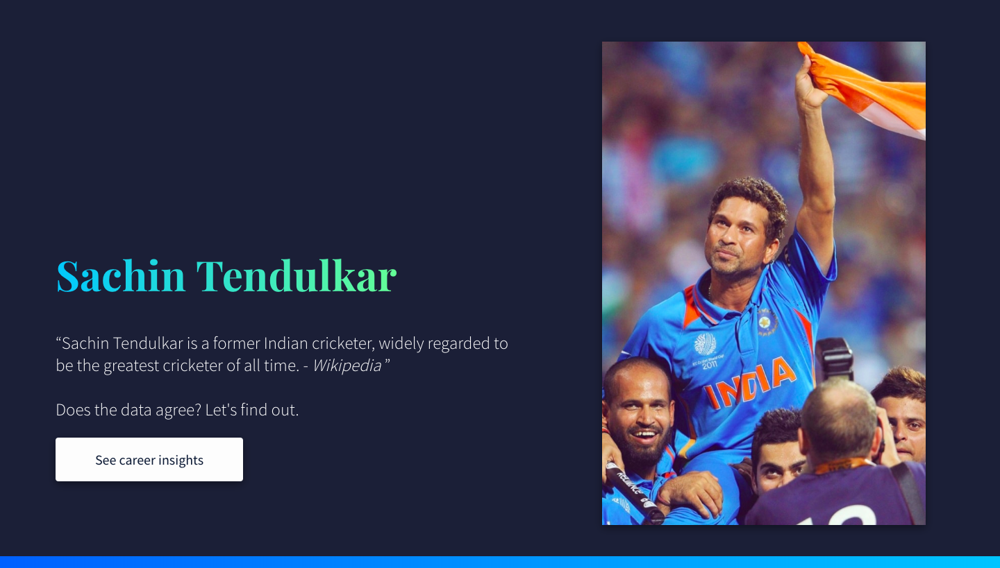

# Testing Tendulkar

### SocialCops frontend assignment

**Problem statement:**

> Sachin Tendulkar is a former Indian cricketer, widely regarded to be the greatest cricketer of all time - Wikipedia.

Use the given [data](https://drive.google.com/file/d/0B2W2LMb5AIVldEZNSGJkeWNjcHM/view) to prove or disprove the above statement.

 

**Solution :**

A Dashboard built on **React** to visualize the stats of Sachin's entire career including runs scored per match against each team, number of wins/loses, stadium insights etc.

 

**Screenshots:**

 

